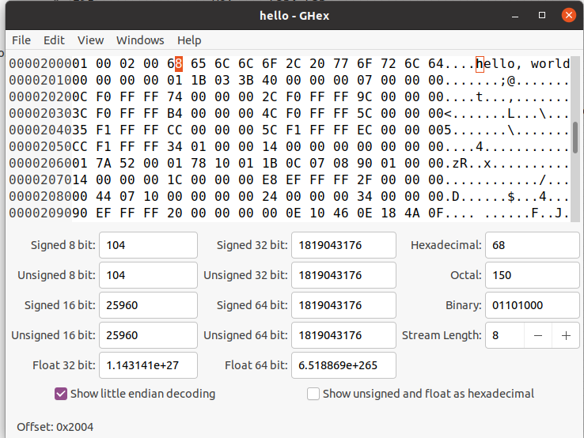
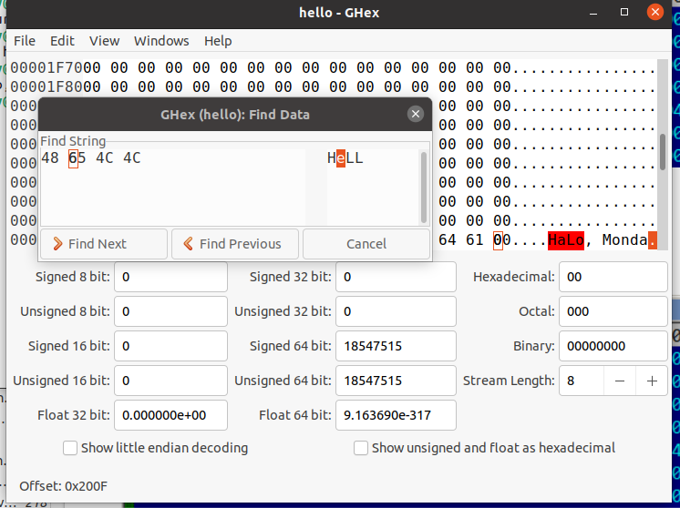

Pattern de code
===============

La méthode
----------

* Lien entre du code en C et du code en Assembleur
* Ecrire du code en C, et voir l’équivalent en assembleur
	* gcc -S code.c
* Le faire avec de petit programme pour en comprendre la structure
* Possibilité de le faire sur : https://godbolt.org/

Niveau d’optimisation et débogage
---------------------------------

* Un compilateur a généralement 3 niveaux d’optimisation
	* Niveau 0: désactive l’optimisation, le compilateur est plus rapide, code plus compréhensible, 
	* Compilateurs avec optimisation: compilateur lent, code qui s’exécute plus vite, 
* En plus des niveaux de compilation un compilateur peut inclure dans le code des informations de débogage peut contenir des liens entre chaque ligne du code source et les adresses du code en machine généré.

La fonction vide
----------------

.. code:: C

	void f(){
		return;
	}

x86-64 clang 12.0.1	
...................

.. code:: asm

	f:                                      # @f
        	push    rbp
        	mov     rbp, rsp
        	pop     rbp
        	ret

Dans ce code le préambule est :

.. code:: asm

	push    rbp
        mov     rbp, rsp
	

Et l'épilogue est:

.. code:: asm

	pop     rbp
        ret     	

Dans le préambule le régistre ``rbp`` est sauvé dans la pile. Puis le contenu du
registre ``rsp`` est sauvé dans le registre ``rbp`` 

Dand l'épilogue la valeur du régistre ``rbp`` est restorer depuis la pile.

Il faut noter qu'il n'y a pas de corps.

x86-64 gcc 10.3
...............

.. code-block:: asm
	:linenos:

	f:
        	push    rbp
        	mov     rbp, rsp
        	nop
        	pop     rbp
        	ret
        	
Cet exemple est similaire au précédent, à la seule différence qu'il ya 
l'instruction ``nop`` pour le corps. L'instruction ``nop`` est une instruction
vide.
 
        	
arm8 clang 11.0.1
.................

.. code-block:: asm
	:linenos:

	f:                                      // @f
		ret

En arm il n'ya pas eu besoin de préambule, ni d'épilogue.
        	
ARM64 gcc 10.3
..............

.. code-block:: asm
	:linenos:

	f:
		nop
		ret
 
Même remarque qu'en ARM64.       	
        	
Fonction vide en pratique
.........................

Bien que les fonctions vides soient inutiles, elles sont assez fréquentes dans 
le code bas niveau. Tout d’abord, les fonctions de débogage sont assez populaires, 
comme celle-ci:

.. code-block:: C
	:linenos:

	void dbg_print (const char *fmt, ...){
	#ifdef _DEBUG
		// open log file
		// write to log file
		// close log file
	#endif
	};
	
	void some_function(){
		...
		dbg_print ("we did something\n") ;
		...
	};

Dans une compilation en non-debug (e.g., “release”), _DEBUG n’est pas défini, 
donc la fonction dbg_print(), bien qu’elle soit appelée pendant l’exécution, sera vide.

Un autre moyen de protection logicielle est de faire plusieurs compilations: 
une pour les clients, une de démonstration. La compilation de démonstration peut
omettre certaines fonctions importantes, comme ici:

.. code-block:: C
	:linenos:

	void save_file (){
	#ifndef DEMO
		// actual saving code
	#endif
	};

La fonction save_file() peut être appelée lorsque l’utilisateur clique sur 
le menu Fichier->Enregistrer. La version de démo peut être livrée avec cet item
du menu désactivé, mais même si un logiciel cracker pourra l’activer, une fonction 
vide sans code utile sera appelée.

Valeur de retour
----------------

Une autre fonction simple est celle qui retourne juste une valeur constante:

.. code-block:: C
	:linenos:

	int f(){
		return 123;
	};
	

x86-64 clang 12.0.1	
...................

.. code-block:: asm
	:linenos:

	f:                                      # @f
        	push    rbp
        	mov     rbp, rsp
        	mov     eax, 123
        	pop     rbp
        	ret

Le registre eax est utilisé pour la valeur de retour de la fonction.

arm8 clang 11.0.1
.................

.. code-block:: asm
	:linenos:

	f:                                      // @f
	        mov     w0, #123
		ret

Le registre ``w0`` est utilisé pour la valeur de retour de la fonction.

x86-64 gcc 10.3
...............

.. code-block:: asm
	:linenos:

	f:
        	push    rbp
        	mov     rbp, rsp
        	mov     eax, 123
        	pop     rbp
        	ret

Le registre eax est utilisé pour la valeur de retour de la fonction.

ARM64 gcc 10.3
..............

.. code-block:: asm
	:linenos:

	f:
        	mov     w0, 123
        	ret

Le registre ``w0`` est utilisé pour la valeur de retour de la fonction.

En pratique
...........

Les fonctions qui retournent simplement 1 (true) ou 0 (false) sont vraiment 
fréquentes en pratique. Les plus petits utilitaires UNIX standard, /bin/true et 
/bin/false renvoient respectivement 0 et 1, comme code de retour. 
(un code retour de zéro signifie en général succès, non-zéro une erreur).

Hello, world!
-------------

Utilisons le fameux exemple du livre [Brian W. Kernighan, Dennis M. Ritchie, 
The C Programming Language, 2nd, (1988)]:

.. code-block:: C
	:linenos:
	
	#include <stdio.h>
	int main(){
		printf("hello, world\n") ;
		return 0;
	}

x86-64 clang 12.0.1	
...................

.. code-block:: asm
	:linenos:

	main:                                   # @main
        	push    rbp
        	mov     rbp, rsp
        	sub     rsp, 16
        	mov     dword ptr [rbp - 4], 0
        	movabs  rdi, offset .L.str
        	mov     al, 0
        	call    printf
        	xor     eax, eax
        	add     rsp, 16
        	pop     rbp
        	ret
	.L.str:
        	.asciz  "hello, world\n"
        	
        	
La ligne ``1`` est le point d'entrée de la fonction ``main``. Les ligne ``2-5``
 représentent le préambule. Il faut noter une réservation d'espace dans la pile.
 
 Les lignes ``6-8`` représente le corps de la fonction ``main``.
 
 Les lignes ``9-12`` représente l'épilogue. Il faut noter la restoration de 
 l'état de la pile. Pourquoi 16? parce qu'il s'agit d'un programme 64 bits.
 et le passage de l'adresse de la constante  stocké dans le segment de données
 ``.L.str`` via le registre ``rdi``.
 
 
x86-64 gcc 10.3
...............

.. code-block:: asm
	:linenos:

	.LC0:
        	.string "hello, world"
	main:
        	push    rbp
        	mov     rbp, rsp
        	mov     edi, OFFSET FLAT:.LC0
        	call    puts
        	mov     eax, 0
        	pop     rbp
        	ret
        	
Ici nous constatons l'utilisation du registre ``edi`` pour l'envoie de 
 l'adresse de la chaîne de caractère stockée dans le segment de données ``.LC0``.
 
 
ARM64 gcc 10.3
...............

.. code-block:: asm
	:linenos:

	.LC0:
        	.string "hello, world"
	main:
        	stp     x29, x30, [sp, -16]!
        	mov     x29, sp
        	adrp    x0, .LC0
        	add     x0, x0, :lo12:.LC0
        	bl      puts
        	mov     w0, 0
        	ldp     x29, x30, [sp], 16
        	ret

Ici nous remarquons l'utilisation des registre ``x0``, du segment de données ``LC0``.

Modification de chaîne
......................

Nous pouvons touver facilement la chaîne dans le binaire en utilisant l'outils 
Ghex sous linux ou l'outil Hiew32 sous Windows.

  

On peut modifier la chaîne de caractère comme suit:

  

Utiliser une autre chaîne d’un binaire (Linux x64)
..................................................

Avec GCC 5.4.0, possibilité d'utiliser un docker d'ubuntu 16.04

.. code-block:: bash

	objdump -s hello3
  

.. code-block:: C

	#include <stdio.h>
	int main(){
		printf(0x400238) ;
		return 0;
	}

Difficile à croire, ce code affiche la chaîne mentionnée.
Changez l’adresse en 0x400260, et la chaîne « GNU » sera affichée. L’adresse est valable pour cette
version spécifique de GCC, outils GNU, etc. Sur votre système, l’exécutable peut être légèrement diffé-
rent, et toutes les adresses seront différentes. Ainsi, ajouter/supprimer du code à/de ce code source va
probablement décaler les adresses en arrière et avant. Mais il faudra l'essayer avec GCC 5.4.0 sous docker.

La pile
-------

La pile est une des structures de données les plus fondamentales en informatique.
Techniquement, il s’agit d’un bloc de mémoire situé dans l’espace d’adressage d’un processus et qui est
utilisé par le registre ``ESP`` en x86, ``RSP`` en x64 ou par le registre ``SP`` en ARM comme un pointeur dans ce bloc mémoire.

Les instructions d’accès à la pile sont ``PUSH`` et ``POP`` (en x86 ainsi qu’en ARM Thumb-mode). ``PUSH`` soustrait à ``ESP``/``RSP``/``SP`` 4 en mode 32-bit (ou 8 en mode 64-bit) et écrit ensuite le contenu de l’opérande associé à l’adresse mémoire pointée par ESP/RSP/SP.

``POP`` est l’opération inverse: elle récupère la donnée depuis l’adresse mémoire pointée par ``SP``, l’écrit dans l’opérande associé (souvent un registre) puis ajoute 4 (ou 8) au pointeur de pile.

Après une allocation sur la pile, le pointeur de pile pointe sur le bas de la pile. ``PUSH`` décrémente le pointeur de pile et ``POP`` l’incrémente.

Le bas de la pile représente en réalité le début de la mémoire allouée pour le bloc de pile. Cela semble
étrange, mais c’est comme ça.

Pourquoi la pile grandit en descendant ?
........................................

Intuitivement, on pourrait penser que la pile grandit vers le haut, i.e. vers des adresses plus élevées,
comme n’importe qu’elle autre structure de données.
La raison pour laquelle la pile grandit vers le bas est probablement historique. Dans le passé, les ordi-
nateurs étaient énormes et occupaient des pièces entières, il était facile de diviser la mémoire en deux
parties, une pour le heap et une pour la pile. Évidemment, on ignorait quelle serait la taille du heap et de
la pile durant l’exécution du programme, donc cette solution était la plus simple possible.

Cela nous rappelle comment certains étudiants prennent des notes pour deux cours différents dans un
seul et même cahier en prenant un cours d’un côté du cahier, et l’autre cours de l’autre côté. Les notes
de cours finissent par se rencontrer à un moment dans le cahier quand il n’y a plus de place.

Quel est le rôle de la pile ?
.............................

**Sauvegarder l’adresse de retour de la fonction**

Lorsque l’on appelle une fonction avec une instruction CALL, l’adresse du point exactement après cette
dernière est sauvegardée sur la pile et un saut inconditionnel à l’adresse de l’opérande CALL est exécuté.

L’instruction ``CALL`` est équivalente à la paire d’instructions

``PUSH address_after_call`` / ``JMP operand``.

``RET`` va chercher une valeur sur la pile et y saute ce qui est équivalent à la paire d’instructions 
``POP tmp`` / ``JMP tmp``.

Déborder de la pile est très facile. Il suffit de lancer une récursion éternelle:

.. code-block:: C
	
	void f(){
		f() ;
	};
	
	
**Passage des arguments d’une fonction**

Le moyen le plus utilisé pour passer des arguments en x86 est appelé « cdecl » :

.. code-block:: asm

	push arg3
	push arg2
	push arg1
	call f
	add esp, 12 ; 4*3=12
	
La fonction appelée reçoit ses arguments par la pile.
Voici donc comment sont stockés les arguments sur la pile avant l’exécution de la première instruction de
la fonction ``f()`` :

.. list-table:: Title
   :widths: 25 25 
   :header-rows: 1

   * - ESP
     - Return Address
   * - ESP+4
     - arguments#1
   * - ESP+8
     - argument#2
   * - ESP + 0xC
     - arguments#3
   * - ...
     - ...
     
À propos, la fonction appelée n’a aucune d’information sur le nombre d’arguments qui ont été passés. Les fonctions C avec un nombre variable d’arguments (comme printf()) déterminent leur nombre en utilisant les spécificateurs de la chaîne de format (qui commencent pas le symbole %).

Si nous écrivons quelque chose comme:

.. code-block:: C

	printf("%d %d %d", 1234) ;
	
printf() va afficher 1234, et deux autres nombres aléatoires 62 , qui sont situés à côté dans la pile.

C’est pourquoi la façon dont la fonction main() est déclarée n’est pas très importante: comme ``main()``, ``main(int argc, char *argv[])`` ou ``main(int argc, char *argv[], char *envp[])``.

En fait, le code-CRT appelle main(), schématiquement, de cette façon:

.. code-block:: asm

	push envp
	push argv
	push argc
	call main
	...
	
Si vous déclarez ``main()`` comme ``main()`` sans argument, ils sont néanmoins toujours présents sur la pile, mais ne sont pas utilisés. Si vous déclarez main() comme 
``main(int argc, char *argv[])``, vous pourrez utiliser les deux premiers arguments, et le troisième restera ``invisible`` pour votre fonction. Il est même possible de déclarer ``main()`` comme ``main(int argc)``, cela fonctionnera.     

**Stockage des variables locales**

Une fonction peut allouer de l’espace sur la pile pour ses variables locales simplement en décrémentant le pointeur de pile vers le bas de la pile.

Donc, c’est très rapide, peu importe combien de variables locales sont définies. 

Ce n’est pas une nécessité de stocker les variables locales sur la pile. Vous pouvez les stocker où bon vous semble, mais c’est traditionnellement fait comme cela.

Une disposition typique de la pile
..................................

.. list-table:: Title
   :widths: 25 25 
   :header-rows: 1
   
   * - ...
     - ...
   * - ESP-OxC
     - variable loale#2
   * - ESP-8
     - variable locale#1
   * - ESP-4
     - valeur enregistrée de EBP
   * - ESP
     - Return Address
   * - ESP+4
     - arguments#1
   * - ESP+8
     - argument#2
   * - ESP + 0xC
     - arguments#3
   * - ...
     - ...
     
Bruit dans la pile
..................

Les valeurs dites « bruitée » ou « poubelle » présente dans la pile ou dans la mémoire sont
des valeurs qui ont été laissées sur la pile après l’exécution de fonctions précédentes. 

Par exemple:

.. code-block:: C

	#include <stdio.h>
	void f1(){
		int a=1, b=2, c=3;
	};
	void f2(){
		int a, b, c ;
		printf ("%d, %d, %d\n", a, b, c) ;
	};
	int main(){
		f1() ;
		f2() ;
	};	
	

.. code-block:: console

	gcc main4.c -o prog
	./prog
	1, 2, 3
	

Quel résultat étrange ! Aucune variables n’a été initialisées dans f2(). Ce sont des valeurs "fantômes" qui sont toujours dans la pile.

printf() avec plusieurs arguments
---------------------------------

.. code-block:: C

	#include <stdio.h>
	int main(){
		printf("a=%d ; b=%d ; c=%d", 1, 2, 3) ;
		return 0;
	};
	
.. code-block:: bash

	todo Montrer comment marche un bon debugger r2 ou autre

Exemple avec GDB
................

.. code-block:: bash

	gcc main_5.c -g -o print
	gdb print
	b printf //pour ajouter un breakpoint à printf
	run      // pour lancer l'exécution du programme
	x/10g $rsp // afficher 10 éléments de la pile.
	x/5i 0x555555555171 // désassembler le code à l'adresse 0x..
	x/s 0x555555555180  // afficher l'adresse du format
	finish
	info registers // examinons les registres
	disas          // désassemblons le code
	step           // faire l'exécution pas à pas
	
	
.. code-block:: bash

	todo revoir le cas de gdb

x64: 8 arguments
................

.. code-block:: C

	#include <stdio.h>
	int main(){
		printf("a=%d ; b=%d ; c=%d ; d=%d ; e=%d ; f=%d ; g=%d ; h=%d\n", 1, 2, 3, 4, 5, 6, 7, 8) ;
		return 0;
	};

.. code-block:: bash

	gcc main_6.c -g -o print8
	gbd print8
	b printf
	info registers
	x/s $rdi
	x/10g   // afficher le contenu de la pile avec giant-word
	
scanf
-----

Maintenant utilisons la fonction ``scanf``.

.. code-block:: C

	#include <stdio.h>
	int main(){
		int x ;
		printf ("Enter X :\n") ;
		scanf ("%d", &x) ;
		printf ("You entered %d...\n", x) ;
		return 0;
	};
	

Il n’est pas astucieux d’utiliser scanf() pour les interactions utilisateurs de nos jours. Mais nous pouvons, toutefois, illustrer le passage d’un pointeur sur une variable de type int.

A propos des pointeurs
......................

Les pointeurs constituent l'un des concepts fondamentaux de l'informatique. 
Passer un gros tableau, une structure ou un objet comme argument à une autre fonction est trop coûteux,
tandis que passer leur adresse l’est très peu. 
Par exemple, si vous voulez afficher une chaîne de texte sur la console, il est plus facile de passer son adresse au noyau de l’OS.

En plus, si la fonction appelée doit modifier quelque chose dans un gros tableau ou structure reçu comme
paramètre et renvoyer le tout, la chose la plus simple est de passer l’adresse du tableau ou de la structure à la fonction appelée, et de la laisser changer ce qui doit l’être.

Un pointeur en ``C/C++`` est simplement l'adresse d’un emplacement mémoire quelconque.
En ``x86``, l'adresse est représentée par un nombre de 32-bit (i.e., il occupe 4 octets), 
tandis qu’en ``x86-64`` c'est un nombre de 64-bit (occupant 8 octets). 

À propos, c'est la cause de l'indignation de certaines personnes concernant le changement vers x86-64—tous les pointeurs en architecture x64 ayant besoin de deux fois plus de place, incluant la mémoire cache, qui est de la mémoire "coûteuse".

Il est possible de travailler seulement avec des pointeurs non typés, moyennant quelques efforts; e.g. la
fonction C standard ``memcpy()``, qui copie un bloc de mémoire d'un endroit à un autre, prend 2 pointeurs de
type ``void*`` comme arguments, puisqu’il est impossible de prévoir le type de données qu'il faudra copier.
Les types de données ne sont pas importants, seule la taille du bloc compte.

Les pointeurs sont aussi couramment utilisés lorsqu'une fonction doit renvoyer plus d'une valeur.

La fonction scanf() en est un exemple.

Hormis le fait que la fonction doit indiquer combien de valeurs ont été lues avec succès, elle doit aussi
renvoyer toutes ces valeurs.

En C/C++ le type du pointeur est seulement nécessaire pour la vérification de type lors de la compilation.

Il n’y a aucune information du tout sur le type des pointeurs à l’intérieur du code compilé.

GCC x86-64
..........

``GCC`` remplace l'appel à ``printf`` avec un appel à ``puts``. Les arguments sont
placés dans la pile avec l'instruction ``mov``.

A propos
........

Ce simple exemple est la démonstration du fait que le compilateur traduit une liste d’expression en bloc-
C/C++ en une liste séquentielle d’instructions. Il n’y a rien entre les expressions en C/C++, et le résultat
en code machine, il n’y a rien entre le déroulement du flux de contrôle d’une expression à la suivante.

Erreur courante
...............

C’est une erreur très courante (et/ou une typo) de passer la valeur de ``x`` au lieu d’un pointeur sur ``x`` :

.. code-block:: C

	#include <stdio.h>
	int main(){
		int x ;
		printf ("Enter X :\n") ;
		scanf ("%d", x) ; // BUG
		printf ("You entered %d...\n", x) ;
		return 0;
	};

Donc que se passe-t-il ici? ``x`` n’est pas non-initialisée et contient des données aléatoires de la pile locale. Lorsque ``scanf()`` est appelée, elle prend la chaîne de l’utilisateur, la convertit en nombre et essaye de l'écrire dans ``x``, la considérant comme une adresse en mémoire. Mais il s’agit de bruit aléatoire, donc
``scanf()`` va essayer d’écrire à une adresse aléatoire. Très probablement, le processus va planter.

Variables globales
..................

Que se passe-t-il si la variable ``x`` de l'exemple précédent n'est pas locale mais globale ? Alors, elle sera accessible depuis n'importe quel point, plus seulement depuis le corps de la fonction. Les variables globales sont considérées comme un ``anti-pattern``, mais dans un but d'expérience, nous pouvons le faire.

.. code-block:: C
	
	#include <stdio.h>
	// x est maintenant une variable globale
	int x ;
	int main(){
		printf ("Enter X :\n") ;
		scanf ("%d", &x) ;
		printf ("You entered %d...\n", x) ;
		return 0;
	};
	
	

.. code-block:: asm

	main:                                   # @main
        	push    rbp
        	mov     rbp, rsp
        	sub     rsp, 16
        	mov     dword ptr [rbp - 4], 0
        	movabs  rdi, offset .L.str
        	mov     al, 0
        	call    printf
        	movabs  rdi, offset .L.str.1
        	movabs  rsi, offset x
        	mov     al, 0
        	call    __isoc99_scanf
        	mov     esi, dword ptr [x]
        	movabs  rdi, offset .L.str.2
        	mov     al, 0
        	call    printf
        	xor     eax, eax
        	add     rsp, 16
        	pop     rbp
        	ret
	.L.str:
        	.asciz  "Enter X :\n"

	.L.str.1:
        	.asciz  "%d"

	x:
        	.long   0                               # 0x0

	.L.str.2:
        	.asciz  "You entered %d...\n"
	

Un segment est créer pour la variable globale x

Variable globale initialisée
............................

.. code-block:: C
	
	#include <stdio.h>
	// x est maintenant une variable globale
	int x = 10;
	int main(){
		printf ("Enter X :\n") ;
		scanf ("%d", &x) ;
		printf ("You entered %d...\n", x) ;
		return 0;
	};
	
``x`` est déclaré dans la section ``.data``

.. code-block:: asm

	main:                                   # @main
        	push    rbp
        	mov     rbp, rsp
        	sub     rsp, 16
        	mov     dword ptr [rbp - 4], 0
        	movabs  rdi, offset .L.str
        	mov     al, 0
        	call    printf
        	movabs  rdi, offset .L.str.1
        	movabs  rsi, offset x
        	mov     al, 0
        	call    __isoc99_scanf
        	mov     esi, dword ptr [x]
        	movabs  rdi, offset .L.str.2
        	mov     al, 0
        	call    printf
        	xor     eax, eax
        	add     rsp, 16
        	pop     rbp
        	ret
	x:
        	.long   10                              # 0xa

	.L.str:
        	.asciz  "Enter X :\n"

	.L.str.1:
        	.asciz  "%d"

	.L.str.2:
        	.asciz  "You entered %d...\n"

Scanf
.....

Comme il a déjà été écrit, il est plutôt dépassé d’utiliser scanf() aujourd’hui. Mais si nous devons, il faut vérifier si ``scanf()`` se termine correctement sans erreur.

.. code-block:: C
	
	#include <stdio.h>
	// x est maintenant une variable globale
	int x = 10;
	int main(){
		printf ("Enter X :\n") ;
		if(scanf ("%d", &x)==1) 
			printf ("You entered %d...\n", x) ;
		else
			printf("What you enter? Euh\n");
		return 0;
	};
	

Par norme, la fonction ``scanf()`` renvoie le nombre de champs qui ont été lus avec succès.
Dans notre cas, si tout se passe bien et que l’utilisateur entre un nombre ``scanf()`` renvoie 1, ou en cas
d’erreur 0.

Ajoutons un peu de code C pour vérifier la valeur de retour de scanf() et afficher un message d’erreur.

Voir les exemples pour différents compilateur sur le site et commenter avec les étudiants.

en cas d’erreur.

.. code-block:: asm

	x:
        	.long   10
	.LC0:
        	.string "Enter X :"
	.LC1:
        	.string "%d"
	.LC2:
        	.string "You entered %d...\n"
	.LC3:
        	.string "What you enter? Euh"
	main:
        	push    rbp
        	mov     rbp, rsp
        	mov     edi, OFFSET FLAT:.LC0
        	call    puts
        	mov     esi, OFFSET FLAT:x
        	mov     edi, OFFSET FLAT:.LC1
        	mov     eax, 0
        	call    __isoc99_scanf
        	cmp     eax, 1
        	jne     .L2
        	mov     eax, DWORD PTR x[rip]
        	mov     esi, eax
        	mov     edi, OFFSET FLAT:.LC2
        	mov     eax, 0
        	call    printf
        	jmp     .L3
	.L2:
        	mov     edi, OFFSET FLAT:.LC3
        	call    puts
	.L3:
        	mov     eax, 0
        	pop     rbp
        	ret	

Accéder aux arguments passés
----------------------------

Maintenant nous savons que la fonction appelante passe les arguments à la fonction appelée par la pile.
Mais comment est-ce que la fonction appelée y accède?

.. code-block:: c

	#include <stdio.h>
	int f (int a, int b, int c) {
		return a*b+c ;
	};
	int main(){
		printf ("%d\n", f(1, 2, 3)) ;
		return 0;
	};

x86 MSVC
........
	

.. code-block:: console

	_DATA   SEGMENT
	COMM    ?_OptionsStorage@ __local_stdio_printf_options@@9@9:QWORD                                                    ; 			`__local_stdio_printf_options'::`2'::_OptionsStorage
	_DATA   ENDS
	_DATA   SEGMENT
	$SG7394 DB        '%d', 0aH, 00H
	_DATA   ENDS

	_a$ = 8                                       ; size = 4
	_b$ = 12                                                ; size = 4
	_c$ = 16                                                ; size = 4
	_f      PROC
        	push    ebp
        	mov     ebp, esp
        	mov     eax, DWORD PTR _a$[ebp]
        	imul    eax, DWORD PTR _b$[ebp]
        	add     eax, DWORD PTR _c$[ebp]
        	pop     ebp
        	ret     0
	_f      ENDP

	_main   PROC
        	push    ebp
        	mov     ebp, esp
        	push    3
        	push    2
        	push    1
        	call    _f
        	add     esp, 12                             ; 0000000cH
        	push    eax
        	push    OFFSET $SG7394
        	call    _printf
        	add     esp, 8
        	xor     eax, eax
        	pop     ebp
        	ret     0
	_main   ENDP
        	
Ce que l’on voit, c’est que la fonction main() pousse 3 nombres sur la pile et appelle f(int,int,int).
L’accès aux arguments à l’intérieur de f() est organisé à l’aide de macros comme:
_a$ = 8, de la même façon que pour les variables locales, mais avec des offsets positifs (accédés avec
plus). Donc, nous accédons à la partie hors de la structure locale de pile en ajoutant la macro _a$ à la
valeur du registre EBP.
Ensuite, la valeur de a est stockée dans EAX. Après l’exécution de l’instruction IMUL, la valeur de EAX est
le produit de la valeur de EAX et du contenu de _b.
Après cela, ADD ajoute la valeur dans _c à EAX.
La valeur dans EAX n’a pas besoin d’être déplacée/copiée : elle est déjà là où elle doit être. Lors du retour
dans la fonction appelante, elle prend la valeur dans EAX et l’utilise comme argument pour printf().

x64 GCC
.......

.. code-block:: asm

	f:
        	push    rbp
        	mov     rbp, rsp
        	mov     DWORD PTR [rbp-4], edi
        	mov     DWORD PTR [rbp-8], esi
        	mov     DWORD PTR [rbp-12], edx
        	mov     eax, DWORD PTR [rbp-4]
        	imul    eax, DWORD PTR [rbp-8]
        	mov     edx, eax
        	mov     eax, DWORD PTR [rbp-12]
        	add     eax, edx
        	pop     rbp
        	ret
	.LC0:
        	.string "%d\n"
	main:
        	push    rbp
        	mov     rbp, rsp
        	mov     edx, 3
        	mov     esi, 2
        	mov     edi, 1
        	call    f
        	mov     esi, eax
        	mov     edi, OFFSET FLAT:.LC0
        	mov     eax, 0
        	call    printf
        	mov     eax, 0
        	pop     rbp
        	ret
        	
Comme on peut le voir, la fonction compacte f() prend tous ses arguments dans des registres.
La fonction ADD est utilisée ici pour l’addition.

Le compilateur doit avoir décidé que cela s’exécutera plus vite que la façon usuelle ce charger des valeurs
dans les registres, qui utilise l’instruction MOV.

Que se passe-t-il si on n’utilise pas le résultat de la fonction?
-----------------------------------------------------------------

printf() renvoie le nombre de caractères écrit avec succès, mais, en pratique, ce résultat est rarement
utilisé. Il est aussi possible d’appeler une fonction dont la finalité est de renvoyer une valeur, et de ne pas l’utiliser:

.. code-block:: c

	int f(){
		// skip first 3 random values :
		rand() ;
		rand() ;
		rand() ;
		// and use 4th :
		return rand() ;
	};

Le résultat de la fonction rand() est mis dans EAX, dans les quatre cas. Mais dans les 3 premiers, la valeur dans EAX n’est pas utilisée.

Renvoyer une structure
----------------------

Revenons au fait que la valeur de retour est passée par le registre EAX.
C’est pourquoi les vieux compilateurs C ne peuvent pas créer de fonction capable de renvoyer quelque
chose qui ne tient pas dans un registre (d’habitude int), mais si besoin, les informations doivent être
renvoyées via un pointeur passé en argument.
Donc, d’habitude, si une fonction doit renvoyer plusieurs valeurs, elle en renvoie une seule, et le reste—par
des pointeurs.
Maintenant, il est possible de renvoyer, disons, une structure entière, mais ce n’est pas encore très po-
pulaire. Si une fonction doit renvoyer une grosse structure, la fonction appelante doit l’allouer et passer
un pointeur sur cette dernière via le premier argument, de manière transparente pour le programmeur.
C’est presque la même chose que de passer un pointeur manuellement dans le premier argument, mais
le compilateur le cache.

.. code-block:: C

	struct s {
		int a ;
		int b ;
		int c ;
	};
	struct s get_some_values (int a){
		struct s rt ;
		rt.a=a+1;
		rt.b=a+2;
		rt.c=a+3;
		return rt ;
	};

Pointeurs
=========

Échanger les valeurs en entrée
------------------------------

.. code-block:: C

	#include <memory.h>
	#include <stdio.h>
	void swap_bytes (unsigned char* first, unsigned char* second){
		unsigned char tmp1 ;
		unsigned char tmp2 ;
		tmp1=*first ;
		tmp2=*second ;
		*first=tmp2 ;
		*second=tmp1 ;
	};
	int main(){
		// copy string into heap, so we will be able to modify it
		char *s=strdup("string") ;
		// swap 2nd and 3rd characters
		swap_bytes (s+1, s+2) ;
		printf ("%s\n", s) ;
	};
	

Les adresses des deux octets sont lues depuis les arguments et durant l’exécution de la fonction sont
copiés dans EDX et EAX.
Donc nous utilisons des pointeurs, il n’y a sans doute pas de meilleure façon de réaliser cette tâche sans
eux.

Renvoyer des valeurs
--------------------

Les pointeurs sont souvent utilisés pour renvoyer des valeurs depuis les fonctions.
Par exemple, lorsqu’une fonction doit renvoyer deux valeurs.

.. code-block:: C

	#include <stdio.h>
	void f1 (int x, int y, int *sum, int *product){
		*sum=x+y ;
		*product=x*y ;
	};
	int sum, product ;
	void main(){
		f1(123, 456, &sum, &product) ;
		printf ("sum=%d, product=%d\n", sum, product) ;
	}
	
	
Opérateur GOTO
--------------

L’opérateur ``GOTO`` est en général considéré comme un anti-pattern, voir [Edgar Dijkstra, Go To Statement
Considered Harmful (1968) ]. Néanmoins, il peut être utilisé raisonnablement, voir [Donald E. Knuth,
Structured Programming with go to Statements (1974)].
Voici un exemple très simple:

.. code-block:: C

	#include <stdio.h>
	int main(){
		printf ("begin\n") ;
		goto exit ;
		printf ("skip me !\n") ;
		exit :
		printf ("end\n") ;
	};
	

